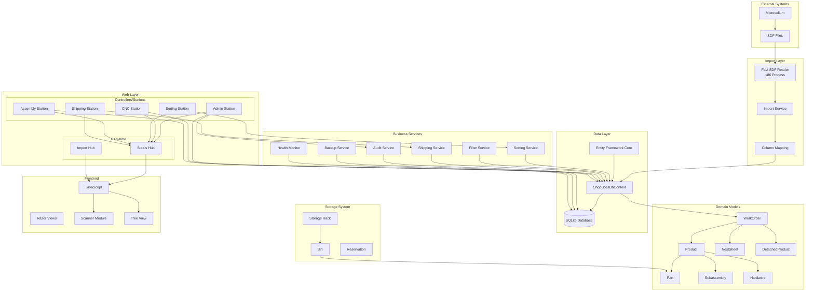
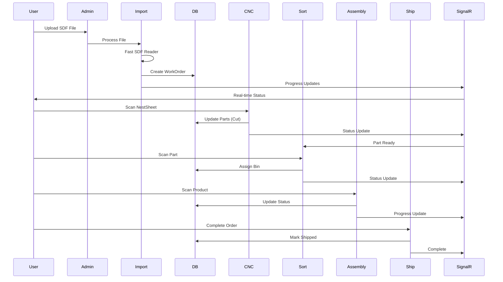
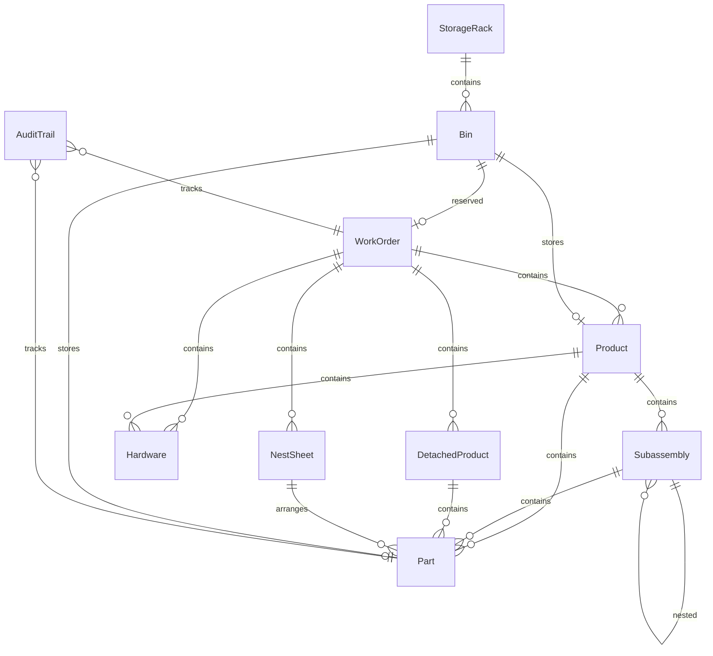
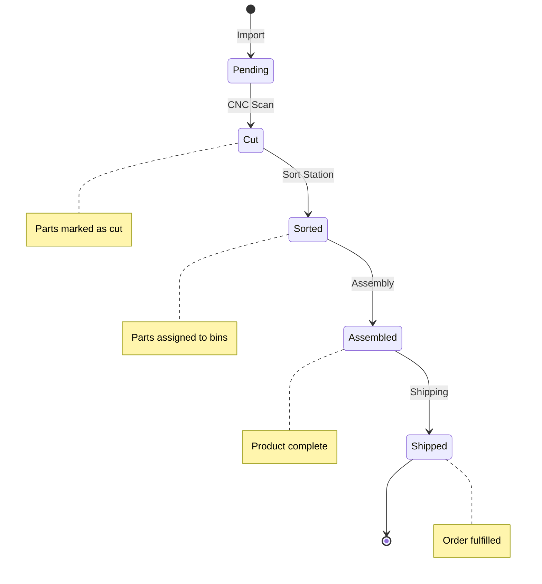
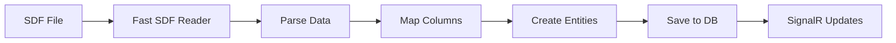
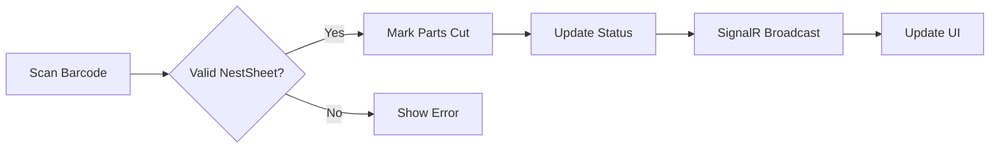
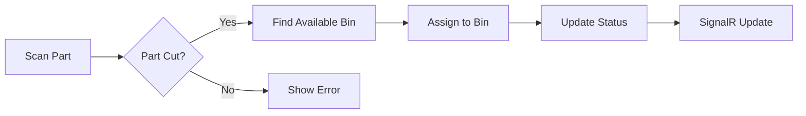
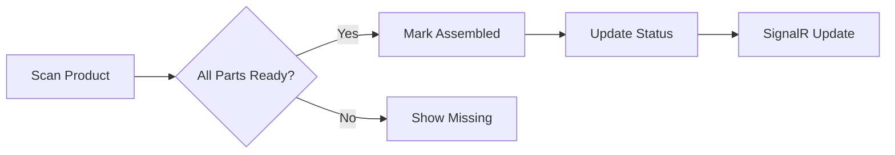
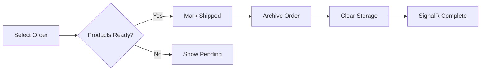

# ShopBoss System Architecture Documentation

## Overview
ShopBoss v2 is a modern shop floor tracking system designed to manage millwork manufacturing workflow from CNC cutting through assembly and shipping. It features hierarchical data import from Microvellum SDF files, real-time status tracking, and comprehensive audit trails.

## Technology Stack
- **Framework**: ASP.NET Core 8.0 MVC
- **Database**: Entity Framework Core 9.0.0 with SQLite
- **Real-time**: SignalR for live status updates
- **Frontend**: Bootstrap 5 with vanilla JavaScript
- **Import**: External x86 process (FastSdfReader) for SDF conversion

## System Architecture Diagram

## Data Flow Diagram

## Domain Model Relationships

## Status Workflow

## Station Workflows

### 1. Import Workflow

### 2. CNC Station Workflow

### 3. Sorting Station Workflow

### 4. Assembly Station Workflow

### 5. Shipping Station Workflow

## Key Components

### Services Layer
- **FastImportService**: High-performance SDF import (0.2s processing)
- **WorkOrderImportService**: Transforms SDF data to domain entities
- **AuditTrailService**: Comprehensive operation logging
- **SortingRuleService**: Part sorting logic
- **BackupService**: Automated backup management
- **SystemHealthMonitor**: Performance and health tracking

### Storage Management
- **StorageRack Types**:
  - Standard (general parts)
  - DoorsAndDrawerFronts
  - AdjustableShelves
  - Hardware
  - Cart (mobile storage)
- **Bin Status**: Empty, Partial, Full, Reserved, Blocked
- **Grid System**: Row/Column addressing (e.g., A01, B02)

### Real-time Communication
- **StatusHub**: Cross-station updates
  - Station groups (cnc-station, sorting-station, etc.)
  - WorkOrder-specific groups
  - Broadcast capabilities
- **ImportProgressHub**: Import progress tracking

### Frontend Architecture
- **universal-scanner.js**: Barcode scanning with cooldown
- **WorkOrderTreeView.js**: Hierarchical data visualization
- **SignalR Integration**: Real-time UI updates
- **Event-driven**: Loose coupling between components

## Security & Audit
- Complete audit trail for all operations
- Session and IP tracking
- User action logging
- Status change history
- Timestamp tracking at each stage

## Performance Optimizations
- Fast SDF import via external process
- Efficient Entity Framework queries
- SignalR for targeted updates
- Background services for maintenance
- Automated backup compression

## Deployment Architecture
- Windows Service compatible
- SQLite database (portable)
- Self-hosted web server
- No external dependencies
- Single-folder deployment